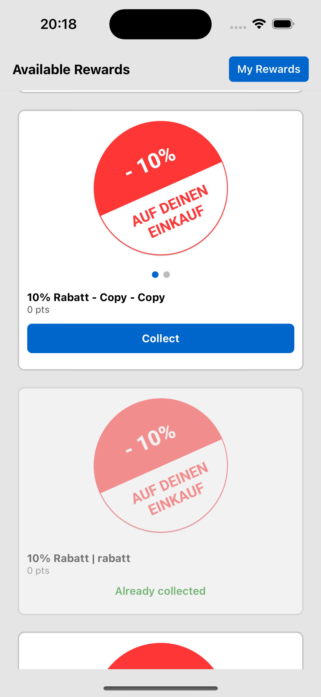
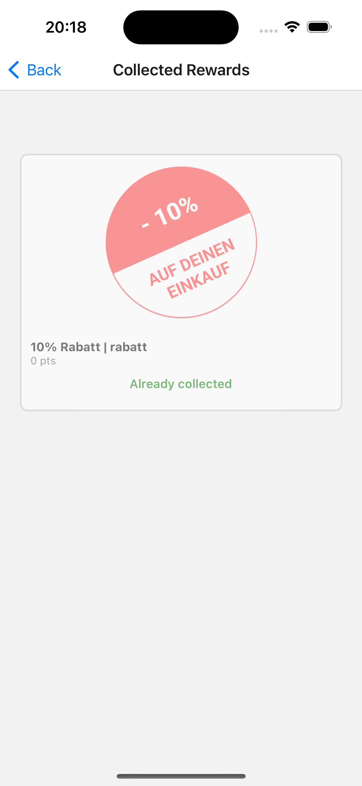

# Hello Again: Candidate Challenge

A React Native app built as part of the Hello Again's Candidate Challenge.  
The project demonstrates navigation, state management with Redux, and screen organization.

---

## 📱 Screenshots

### Available Rewards


### Collected Rewards


---

## 📂 Project Structure
```
src/
│
├── components/ # Reusable UI components (RewardItem)
├── navigation/ # Navigation setup (AppNavigator)
├── redux/      # Redux store, slices, hooks and types for global state management
└── screens/    # Application screens (AvailableRewards, CollectedRewards)
```
---

## 🚀 Tech Stack

- React Native  
- React Navigation  
- Redux Toolkit  

---

## ⚙️ Setup & Run

1. Clone the repository:
```
 git clone https://github.com/tgprudencio/hello-again-challenge.git
 cd hello-again-challenge
```
2. Install dependencies:
```
 npm install
```
3. Run on Android:
```    
 npx react-native run-android
```
4. Run on iOS:
```
 npx pod-install ios
 npx react-native run-ios
```